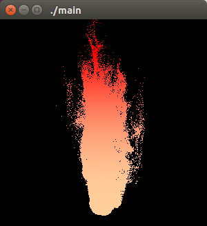
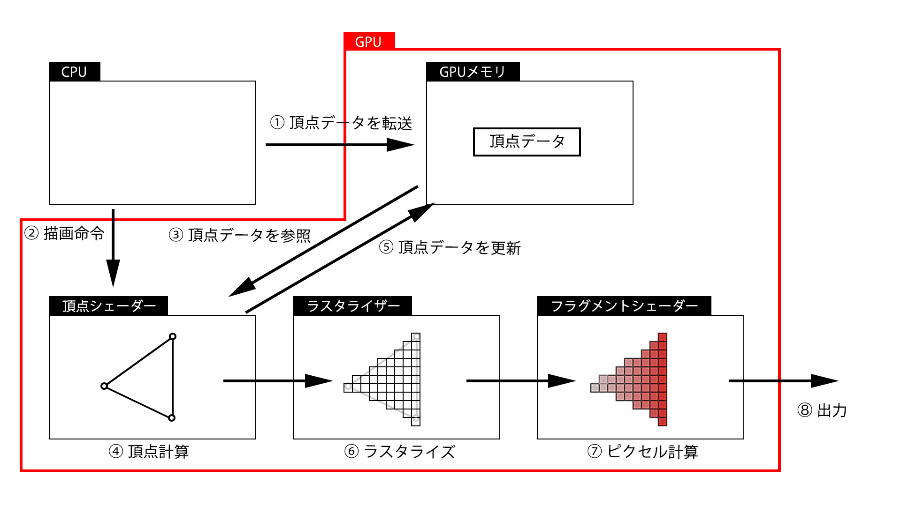

# Curl Noise Fire
Transform Feedback と Curl Noise を利用したGPUパーティクルによる炎の表現

## Transform Feedback
GPUを利用した演算方法の一つを利用し、多量パーティクルの位置更新をGPUに行わせた。具体的な処理の流れ。
1. Bufferを2つ用意(GPU側のメモリに
マップ)
2. 一方のBufferの物理値から新しい物理
値を計算
3. もう片方のBufferに保存
4. 値参照用と保存用のBufferを入れ替え
る

Transform Feedbackのイメージ図は以下のよう。

## Curl Noise
流体表現で有名なのはパーリンノイズだが、今回はCurl Noiseを利用。Curl Noiseは流体の質量保存則（入ってきた量だけ出る）を満たすために作られたNoise関数。パーリンノイズはこの法則が満たされていないよう。

# Demo
## How to?
### 実行環境
* ubuntu 16.04 LTS
* OpenGL 3.0 mesa 18.05
* GLSL 1.2

### コンパイル方法
当該ディレクトリで
    $make
してください。

### Tips
発生間隔がおかしい場合、simple.vert のdtimeを（おすすめは0...1の間で）調整してください。

粒子のばらつきが大きい時、simple.vert のnoise_strengthを（おすすめは1...5で)調整してください